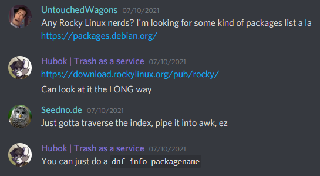
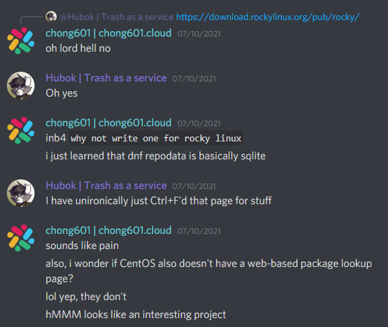

# rpm-package-explorer
No more Ctrl+F to find RPM packages in repositories!

And good god ~~why did I commit to this~~ DNF repository data is complicated.

# "Oh no not another @chong601's project, now what?"
This is not fun.

Of course, I got interested and decided to make it a real thing.

Not like I use RHEL on any of my systems. 

# OK, why this project?
Simple. Try searching for a package explorer for CentOS, Rocky Linux and Alma Linux. Except https://pkgs.org.

And because some people in [r/Homelab](https://reddit.com/r/homelab) raised up the issue with finding packages available in RPM-based Linux distros.

Side note: this project has no intention to compete with https://pkgs.org. It is intended for me to learn and practice my Python skills while hopefully will help other people that would benefit from this project.

# Why not just copy DNF repository code and use that instead?
While DNF indeed uses Python, it depends on [Hawkey](https://github.com/rpm-software-management/libdnf/tree/dnf-4-master/python/hawkey) which provides repository data parsing which is written in C.

It is not possible to bring this with the app as it requires compiling from source to generate the Python modules. 

It's easier (for now) to just reimplement those that I need to use by clean-room-ish reverse-engineering.

# Planned version support
Anything RPM that uses `repodata` as package metadata will be supported.

- CentOS: 3.7 and above
- Fedora: 2 and above
- Rocky Linux: 8.3 and above
- Alma Linux: 8.3 and above
- RHEL: Probably not, don't think I can get any repodata from them

Currently supported OS repository data will be prioritized first.

# How can I help with this project?
There are multiple ways you can help with this project.

You can help sponsoring this project through [Buy me a Coffee™](https://www.buymeacoffee.com/chong601). The funds contributed there will be used to help:
- offset the cloud hosting costs (those ain't cheap!)
- do more open-source projects that would help other people

OR if you have decent Python skills ~~and don't mind reading my spaghetti code~~, feel free to fork this project, add the feature that would be nice to have and make a pull request.

# License
rpm-package-explorer is released under the MIT License. Refer to [LICENSE](./LICENSE) file for the full license text.